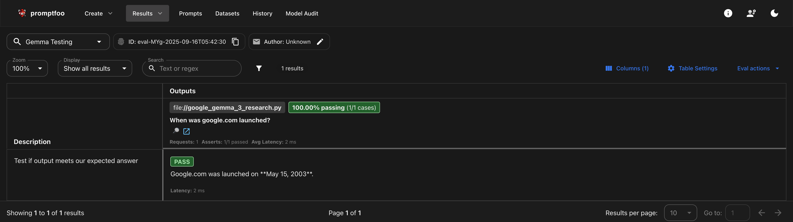
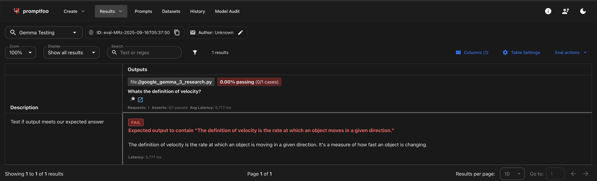

## Gemma3 Model Evaluation using Promptfoo
- I have used Google's gemma3 model via Hugging face transformers to generate text output for simple prompts
- With the help of `promptfoo` I have evaluated some simple assertions and used python as the output provider to promptfoo's eval engine

## How to Run?
- Clone the project and run `pip install -r requirements.txt`
- cd `getting-started`
- run` npx promptfoo@latest eval` 

## Example Test Report
- Run `promptfoo view` 
- Choose yes to view in browser e.g. http://localhost:15500/eval
- Example Test Report view

